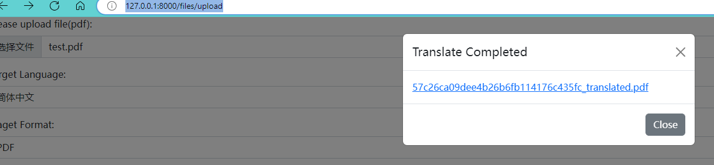
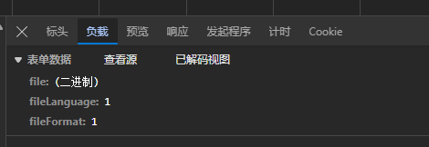
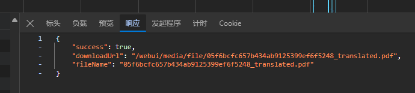

# AI文件翻译

## 简介

AI文件翻译是一款基于OpenAI的API开发的工具，用于将文件内容翻译成多种目标语言。该工具支持翻译为简体中文、繁体中文、英语、日语，四种语言。用户可以通过简单易用的Web用户界面（WebUI）进行文件翻译，也可以通过API的形式调用进行翻译。这使得用户可以根据自己的需求和偏好选择合适的方式进行翻译操作。同时，AI文件翻译还支持导出翻译结果为PDF和Markdown文件，方便用户在不同平台和场景下使用和分享翻译内容。


## 准备环境: 
- 安装Miniconda [参考官方文档](https://docs.anaconda.com/free/miniconda/index.html)
- 创建并激活新的虚拟环境（可选）
  ```bash
  conda create -n translator python=3.10
  conda activate translator
  ``` 

## 启动:
  ```bash
  pip install -r requirements.txt
  python3 ./webui/manage.py runserver
  ```
  启动成功后,可以看到如下信息:


### WebUI模式:
- 打开浏览器，访问指定的Web地址 [http://127.0.0.1:8000/files/upload](http://127.0.0.1:8000/files/upload)
- 在Web界面中上传待翻译文件，选择目标语言和翻译格式，点击翻译按钮进行翻译操作
- 翻译成功后 会如图提示:
  

### API模式:
- 启动成功后
- 使用HTTP请求或其他方式调用API接口
- 接口地址是: http://127.0.0.1:8000/files/uploadFileAndTranslate
参数说明:
file: 文件对象
fileLanguage:转换后的语言(传值为code)


| code | 语言       |
|------|------------|
| 1    | 简体中文   |
| 2    | 繁体中文   |
| 3    | English    |
| 4    | 日本語     |

fileFormat:转换后的文件格式(传值为code)   

| 编号 | 格式       |
|------|------------|
| 1    | PDF        |
| 2    | Markdown   |

请求参数示例:


返回参数示例:


下载地址为：域名+downloadUrl的值。如: http://127.0.0.1:8000/webui/media/file/05f6bcfc657b434ab9125399ef6f5248_translated.pdf
